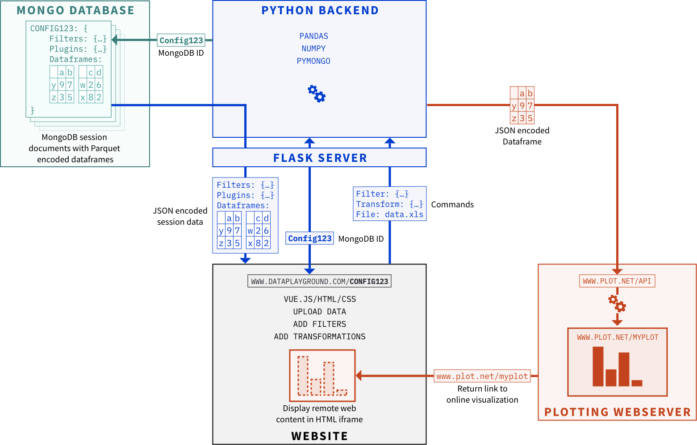

# Micromix user guide

## Contents
- [Micromix](README.md#micromix-user-guide)
- [Installing and running](installing_running_micromix.md#installing-and-running-micromix)
    - [Micromix](installing_running_micromix.md#1-installing-and-running-micromix)
    - [Plugins](installing_running_plugins.md#1-installing-and-running-plugins)
- [Using Micromix](using_micromix.md#micromix-user-guide)
    - [Selecting organism](using_micromix.md#selecting-organism)
    - [Selecting datasets](using_micromix.md#selecting-datasets)
    - [Uploading datasets](using_micromix.md#uploading-datasets)
    - [Combining datasets](using_micromix.md#combining-datasets)
    - [Filtering data](using_micromix.md#filtering-data)
    - [Visualising data](using_micromix.md#visualising-data)  
- [Modifying Micromix](modifying_micromix.md#micromix-user-guide)
    - [Preparing a new bacteria](modifying_micromix.md#preparing-a-new-bacteria)
    - [How to add a new organism](modifying_micromix.md#how-to-add-a-new-organism)
    - [How to add new expression data](modifying_micromix.md#how-to-add-new-expression-data)
    - [Modifying or adding gene or pathway annotations](modifying_micromix.md#modifying-or-adding-gene-or-pathway-annotations)
    - [Adding new visualisation plugins](modifying_micromix.md#adding-new-visualisation-plugins)
    - [Database maintenance](modifying_micromix.md#database-maintenance)

  

# Micromix

## Background
Micromix is designed as a visualization platform to easily view next-generation sequencing data, such as RNA-seq counts. It primarily focuses on prokaryotic data, such as bacteria, which comes pre-bundled, which comes pre-bundled with Salmonella and Bacteroides. Users can include different bacteria, where associated data can be filtered and/or transformed, then visualized through plugins like heatmaps to examine biological patterns.

## Infrastructure
The site comprises a backend (Flask) and a frontend (Vue.js) that communicate with each other, saving data from each session using MongoDB. Plugins within the site are typically set up on separate servers, displaying a visualisation within the site.

Each user session is stored with a unique ID, allowing session information to be re-loaded by passing the unique ID into the URL. For example: [https://micromix.helmholtz-hiri.de/bacteroides/?config=667e67422e5a30d66f793d96](https://micromix.helmholtz-hiri.de/bacteroides/?config=667e67422e5a30d66f793d96). These links can be shared with collaborators to examine specific data patterns from data within the site, or unique user data they have manually uploaded.

 
 

