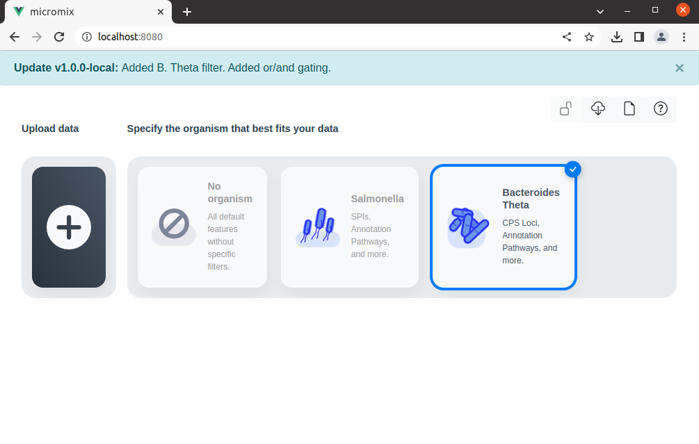
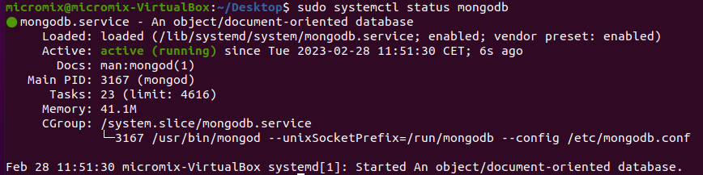
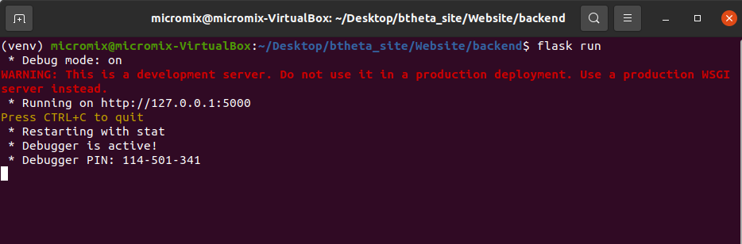
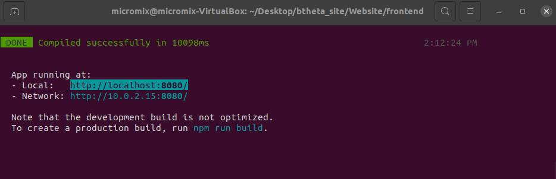

# Micromix user guide

## Contents
- [Micromix](README.md#micromix-user-guide)
- [Installing and running](installing_running.md#installing-and-running-micromix)
    - [Micromix](installing_running.md#installing-and-running-micromix)
        - [1. Local installation](installing_running.md#installing-and-running-micromix)
            - [1.1 Virtual machine](installing_running.md#1-using-a-pre-built-virtual-machine)
            - [1.2 Containers](installing_running.md#2-using-docker-containers)
            - [1.3 Manual install](installing_running.md#3-manually-installing-micromix)
        - [2. Server deployment](installing_running.md#server-deployment)
            - [2.1 Containers](installing_running.md#2-using-docker-containers)
            - [2.2 Manual install](installing_running.md#3-manually-installing-micromix)
    - [Plugins](installing_running.md#installing-and-running-micromix)
- [Using Micromix](using_micromix.md#micromix-user-guide)
    - [Selecting organism](using_micromix.md#selecting-organism)
    - [Selecting datasets](using_micromix.md#selecting-datasets)
    - [Combining datasets](using_micromix.md#combining-datasets)
    - [Filtering data](using_micromix.md#filtering-data)
    - [Visualising data](using_micromix.md#visualising-data)  
- [Modifying Micromix](modifying_micromix.md#micromix-user-guide)
    - [Preparing a new bacteria](modifying_micromix.md#preparing-a-new-bacteria)
    - [How to add a new organism](modifying_micromix.md#how-to-add-a-new-organism)
    - [How to add new expression data](modifying_micromix.md#how-to-add-new-expression-data)
    - [Modifying or adding gene or pathway annotations](modifying_micromix.md#modifying-or-adding-gene-or-pathway-annotations)
    - [Adding new visualisation plugins](modifying_micromix.md#adding-new-visualisation-plugins)
    - [Database maintenance](modifying_micromix.md#database-maintenance)


<br><br>


# 1. Installing and running Micromix

There are three options to use Micromix, depending on the user requirements.

1.1) Using a pre-built virtual machine <br>
1.2) Using Docker containers <br>
1.3) Manually installing Micromix

## 1.1. Using a pre-built virtual machine

The simplest way to use Micromix is to use our pre-built virtual machine (VM). This is available for download **INSERT HYPERLINK**. 

> *Note: <br>
> Using our pre-configured VM allows you to test Micromix out within minimal effort. This environment cannot be used to publically share sessions, its only available on the machine it is installed on.*

The image was created using VirtualBox (version 6.1), free software that can be run on all operating systems, and can be downloaded [here](https://www.virtualbox.org/wiki/Download_Old_Builds_6_1).

To create the VM using the downloaded image: within VirtualBox, click on **New**, then select **Expert mode**. Choose **use an existing virtual hard disk file** and select the downloaded Micromix VM. Make sure the operating system is set to **Linux - Ubuntu - 64bit**, and adjust the memory to a desired size (we recommend about 4GB). Then click on **Create**. 

Once created, we also recommend going into **Settings >> System >> Processor** and changing to 2 or greater, which makes Micromix run smoother. 

To run the VM, click on **Start** (the green arrow). Once running, you will need to start the website and the heatmap.

```bash
# On the desktop are two files:

# To start the website
# Open a terminal (right click - 'Open in terminal')
./run_website.sh 

# To start the HIRI heatmap - open another terminal
./run_heatmap.sh

```

The site can be accessed by opening the browser and typing **localhost:8080**



<br> 

> *Note: <br>
> This VM was created in development mode and should mainly be used for exploration and testing. If you want to run Micromix on a server that you can share with other users, you should use option 2 or 3 below.*  

## 1.2. Using Docker containers

Docker is a platform that automates the deployment of applications inside lightweight, portable containers. These containers package up the application, along with its environment and dependencies, ensuring consistency across different environments. 

The following steps assume:
 - You have access to a debian-based Linux 64-bit machine
 - You have sudo (admin) access

We have created Micromix so it can be installed and run with Docker. To prepare the machine for Micromix to work properly, we will need to install various software.


1. Install Docker: The latest instructions can be found [here](https://docs.docker.com/engine/install/ubuntu/)

```bash
# Uninstall old versions or conflicting packages
for pkg in docker.io docker-doc docker-compose docker-compose-v2 podman-docker containerd runc; do sudo apt-get remove $pkg; done

# Add Docker's official GPG key:
sudo apt-get update
sudo apt-get install ca-certificates curl
sudo install -m 0755 -d /etc/apt/keyrings
sudo curl -fsSL https://download.docker.com/linux/ubuntu/gpg -o /etc/apt/keyrings/docker.asc
sudo chmod a+r /etc/apt/keyrings/docker.asc

# Add the repository to Apt sources:
echo \
  "deb [arch=$(dpkg --print-architecture) signed-by=/etc/apt/keyrings/docker.asc] https://download.docker.com/linux/ubuntu \
  $(. /etc/os-release && echo "$VERSION_CODENAME") stable" | \
  sudo tee /etc/apt/sources.list.d/docker.list > /dev/null

# Update
sudo apt-get update

# Install
sudo apt-get install docker-ce docker-ce-cli containerd.io docker-buildx-plugin docker-compose-plugin

# Test install (this will download a test container and display "Hello from Docker!")
sudo docker run hello-world

# Add current user to the docker user group, so you don't have to run docker with sudo each time
sudo usermod -aG docker $USER

```

2. Install MongoDB (we install this locally so user sessions are not lost if the containers need to be restarted or replaced etc). 

> *It is important to install MongoDB after Docker, otherwise you will get errors when trying to add 172.17.0.1*

```bash
# Install MongoDB
sudo apt install -y mongodb #or from here if this fails or not using Ubuntu: https://www.mongodb.com/docs/manual/tutorial/install-mongodb-on-ubuntu/

# Confirm it is running
sudo systemctl status mongodb

# If not, then start with
sudo systemctl start mongodb

# We also need to add in an additional IP address that allows Docker to communicate with this local installation of MongoDB
sudo vim /etc/mongodb.conf

# You will need to add in 172.17.0.1 so the bind_ip address has two values
bind_ip = 127.0.0.1,172.17.0.1 

# Restart mongoDB
sudo systemctl restart mongodb
```

> *172.17.0.1 is typically used by Docker's bridge network to allow the containers to connect with the host version of MongoDB*

3. Download Micromix repository from Github

```bash
git clone https://github.com/BarquistLab/Micromix.git
```


4. Run Micromix

```bash
# Browse to the correct directory
cd Micromix/Website

# Run docker compose
# This is linked to two dockerfiles, one for the backend and one for the frontend
sudo docker compose build 
sudo docker compose up

# If you require that the containers run in the background, you can use
docker compose up --detach

# These two commands may take some time to complete
# Once the containers have completed running, you should see this line from the command line (or something similar)
* Running on http://127.0.0.1:7000 

# Browse to this address in your browser, and Micromix will be running

# To stop the containers - first press 'ctrl + C', then
docker compose down

# To also remove the associated volumes (-v) and images (-)
docker compose down --volumes --rmi

# To remove all containers, volumes (-v) and images (-) etc
docker system prune --all --volumes
```


> *Note: <br>
> Following these commands will allow you to run Micromix on any compatible computer. If you would like to setup a Micromix server that can be publically viewed through the internet, see [Server deployment](installing_running.md#server-deployment).*


## 1.3. Manually installing Micromix

There are a number of requirements if running locally or on a server for the first time. 

**Step 1:** Download the git repository: 
```bash
# Install Git
sudo apt-get install git

# Download Micromix repository from GitHub
git clone https://github.com/BarquistLab/Micromix.git
```  

**Step 2:** Install required software and run:


**MongoDB:**

As previously discussed, the site stores the underlying data and user session data within MongoDB, and needs to be running in the background.

```bash
# Install MongoDB
sudo apt install -y mongodb

# Confirm it is running
sudo systemctl status mongodb

# If not, then start with
sudo systemctl start mongodb
```




**The backend:**

```bash
sudo apt update
sudo apt install python3-pip
pip3 install wheel
pip3 install biopython

# To allow virtual env (check python version first)
sudo apt-get install python3.8-venv 

# Change to backend
cd Micromix/Website/backend

# Create python virtual environment
python3 -m venv venv

# Enter the environment
source venv/bin/activate

# Install the required python libraries
pip3 install -r requirements.txt

# Enable debugging (optional)
export FLASK_DEBUG=1

# Launch Flask server
flask run --port 3000

# You should see the following output
```




**The frontend:**
```bash
# Change to the frontend
cd Micromix/Website/frontend

# Make sure dependencies are already installed
sudo apt-get install gcc g++ make
sudo apt-get install libssl-dev libcurl4-openssl-dev

# Download and install Node.js
sudo apt install curl
curl -sL https://deb.nodesource.com/setup_18.x -o nodejs_setup.sh
# Change permissions
sudo chmod 777 nodejs_setup.sh
# Run
sudo ./nodejs_setup.sh
# Install
sudo apt-get install -y nodejs

# Install vue-cli with Node Package Manager (npm)
sudo npm install -g @vue/cli

# Install Eslint and axios
npm install --save-dev eslint eslint-plugin-vue
npm i axios

# Initialise ESLint
./node_modules/.bin/eslint --init

# Use these responses
✔ How would you like to use ESLint? · "To check syntax and find problems"
✔ What type of modules does your project use? · "syntax and markup" #default option
✔ Which framework does your project use? · "vue"
✔ Does your project use TypeScript? · "No"
✔ Where does your code run? · "browser"
✔ What format do you want your config file to be in? · "JavaScript"
The config that youve selected requires the following dependencies:

eslint-plugin-vue@latest
✔ Would you like to install them now with npm? · "Yes"
Installing eslint-plugin-vue@latest

# This creates a file called .eslintrc.js

# You will need to modify this file in 2 places
# 1) Comment out the line below to avoid an error about process not being defined (or similar)

vim .eslintrc.js

    "extends": [
        //"eslint:recommended",  //comment this line
        "plugin:vue/essential"

# 2) Add a rule to allow multi-word component names
"rules": {
        'vue/multi-word-component-names': 'off',
    }

# Finally, we can install node dependencies
npm install

# Launch frontend
npm run serve

# You should see the following output
```
> Open the address shown in the terminal where you executed the line above with your web browser. This should be http://localhost:8080/. The backend should also be running, otherwise the site will not load.




> At this point, the site will be functional and users can browse datasets, apply filters and use available plugins, apart from the Heatmap - which requires further installation.


<br>

# 2. Server deployment

This section allows you to run Micromix on a server that is accessible to the public. If using the default Micromix Github code, you will have Salmonella and Bacteroides data. 

To host your own data, you can edit this code on a test machine first and copy to your server, or on the fly on your server.

Similar to a local install, you have the option of installing Micromix using Docker containers, or with a manual installation.

> *Note: <br>
> The code within the Github repository was adapted to run on a local machine for testing, making it easy for people to test Micromix. To run Micromix on a server, some small changes are required that revolve around linking the server IP address or domain name.*

<br>

To make Micromix accessible through the internet, you will need to have access to a running online server that is capable of publically displaying websites with an IP address.

If you don't have any institute or department hosting services available, you can create and run a virtual machine from different web services, such as Amazon Web Services (AWS) or using Google Cloud. An AWS tutorial can be viewed [here](https://aws.amazon.com/getting-started/launch-a-virtual-machine-B-0/), and with Google Cloud [here](https://cloud.google.com/compute/docs/create-linux-vm-instance). 

If choosing one of these online services, here is a checklist of requirements:

 - You will need to use a Debian-based Linux distribution (64-bit) - we recommend Ubuntu. 
 - Depending on the expected traffic, 2 cores, 8-16GB of ram and between 10-20GB of hard drive space should initially be sufficient
 - When configuring the VM, ensure that it is assigned a public IP address - this is important for the site to be hosted (you will need to remember the IP address for later steps).
 - Port 5000 will need to be opened, allowing the frontend and backend to communicate. Under a Google Cloud VM, this firewall rule can be added by going to the **Navigation menu** >>  **VPC network** >> **Firewall**. From here, select **Create firewall rule**, using default options, but changing the protocol to **TCP**, the port to **5000**, Type to **Ingress** and **Apply to all targets**. 


Once you have access to a running server, you will first need to install MongoDB (we install this locally so user sessions are not lost if the containers need to be restarted or replaced etc).


```bash
# Install MongoDB
sudo apt install -y mongodb

# Start MongoDB (it should automatically be running)
sudo systemctl start mongodb

# Confirm it is running
sudo systemctl status mongodb
```

Download Micromix repository from Github

```bash
git clone https://github.com/BarquistLab/Micromix.git
```

**You now have two options.**

2.1) Use Docker containers to run the site, or <br>
2.2) Manually install Micromix.

> *Note: <br> 
> Here are some suggestions if you are unsure about which option to select. If using the Docker containers, this is intended to streamline the installation process, but will take up more hard drive space as the containers require between 2-3GB and requires slightly more network configuration changes. The manual install option takes more time to install, but takes up less space and has more straight forward network requirements.* 

## 2.1. Using Docker containers

Update MongoDB

```bash
# We need to add in an additional IP address that allows Docker to communicate with this local installation of MongoDB
sudo vim /etc/mongodb.conf

# You will need to add in 172.17.0.1 so the bind_ip address has two values
bind_ip = 127.0.0.1,172.17.0.1 

# Restart mongoDB
sudo systemctl restart mongodb

# Confirm it is running
sudo systemctl status mongodb
```

Install Docker

The following steps 1-3 are identical to [Containers](installing_running.md#2-using-docker-containers) - and can be skipped if already completed.

The latest Docker instructions can be found [here](https://docs.docker.com/engine/install/ubuntu/) if any errors occur.

```bash
# Uninstall old versions or conflicting packages
for pkg in docker.io docker-doc docker-compose docker-compose-v2 podman-docker containerd runc; do sudo apt-get remove $pkg; done

# Add Docker's official GPG key:
sudo apt-get update
sudo apt-get install ca-certificates curl
sudo install -m 0755 -d /etc/apt/keyrings
sudo curl -fsSL https://download.docker.com/linux/ubuntu/gpg -o /etc/apt/keyrings/docker.asc
sudo chmod a+r /etc/apt/keyrings/docker.asc

# Add the repository to Apt sources:
echo \
  "deb [arch=$(dpkg --print-architecture) signed-by=/etc/apt/keyrings/docker.asc] https://download.docker.com/linux/ubuntu \
  $(. /etc/os-release && echo "$VERSION_CODENAME") stable" | \
  sudo tee /etc/apt/sources.list.d/docker.list > /dev/null
# update
sudo apt-get update
```


**Frontend changes:**

Change the IP address to your servers IP address

```bash
# Open App.vue
vim Website/frontend/src/App.vue

# Change the line that points to the backend
# backend_url: 'http://127.0.0.1:5000', //This should be changed for production
# Change this to your server IP address or domain name
backend_url: 'http://192.100.12.87:5000', 
``` 


**Backend changes:**

You will need to make some changes to the Dockerfile

```bash
# Open the backend Dockerfile
vim Website/backend/Dockerfile

# Just before exposing port 5000, add in the installation of Gunicorn
# RUN pip install gunicorn 

# Comment out or remove all code after exposing port 5000, and add in 
# CMD ["gunicorn", "--bind", "0.0.0.0:5000", "app:app"]
```

**Docker compose changes:**

The last step before running is to change the port to 80, allowing users to enter in the IP address or domain name without having to specify a port, as port 80 is the default port for websites.

```bash
# Open docker-compose.yaml
vim docker-compose.yaml

# Change the frontend port from "7000:80" to "80:80"
```

Deploy Micromix 

```bash
# Browse to the correct directory
cd Micromix/Website

# Run docker compose
# This is linked to two dockerfiles, one for the backend and one for the frontend
sudo docker compose build 
sudo docker compose up

# If you require that the containers run in the background, you can use
docker compose up --detach

# These two commands may take some time to complete
# Once the containers have completed running, they will stay running in the console window, displaying traffic information related to the site. You can now visit your IP address or domain name and Micromix will be running. 


# To stop the containers - first press 'ctrl + C', then
docker compose down

# To also remove the associated volumes (-v) and images (-)
docker compose down --volumes --rmi

# To remove all containers, volumes (-v) and images (-) etc
docker system prune --all --volumes
```


### 2.2 Manual installation
 
To prepare the server with the required software, you will need to follow the instructions from [Manually installing Micromix](installing_running.md#3-manually-installing-micromix). You can skip the last steps of ```npm run serve``` for the frontend and ```flask run --port 3000``` for the backend.

> *Note: <br>
> The code within the Github repository is adapted to run on a local machine for testing, making it easy for people to test Micromix. To run Micromix on a server, some small changes are required that revolve around linking the server IP address or domain name.*


**Frontend changes:**

Change the IP address to your servers IP address

```bash
# Open App.vue
vim Website/frontend/src/App.vue

# Change the line that points to the backend
# backend_url: 'http://127.0.0.1:5000', //This should be changed for production
# Change this to your server IP address or domain name
backend_url: 'http://192.100.12.87:5000', 
``` 

You can now build the frontend

```bash
# Change to frontend
cd Website/frontend

# Building the site will create files under the /dir directory 
npm run build
```

**Backend changes:**

Change the address of MongoDB
```bash
# Change to backend
cd ../backend

# Open up app.py
vim app.py

# Change this line: client = MongoClient('172.17.0.1', 27017) - pointing directly to the local machine
client = MongoClient()

```

**Install deployment software:**

Finally, we need to install and run a HTTP server (Nginx) and a web server gateway interface (WSGI) (Gunicorn), allowing the site to hosted and displayed to users on the IP address or domain name, such as *Micromix.com*. 

```bash
# Install Gunicorn
pip3 install gunicorn 

# Install Nginx
sudo apt install nginx
```

Run Gunicorn

```bash
# Make sure you are in the backend folder where app.py is located
gunicorn --bind 0.0.0.0:5000 app:app --access-logfile /home/$USER/Micromix/Website/backend/gunicorn_logs.log --workers=2

# Here's a brief explanation of what the command contains
# --bind 0.0.0.0:5000   binds the backend to port 5000, which will be used by the frontend to connect
# app:app               Runs app within app.py
# --access-logfile      Saves the log files to the current user location
# --workers=2           Uses 2 cores

# Note: running the above command is designed to check for any errors. If successful, press CTRL+C to stop running. 
# To run in the background, use:
gunicorn --bind 0.0.0.0:5000 app:app --access-logfile /home/$USER/Micromix/Website/backend/gunicorn_logs.log --workers=2 --daemon
```

Install, configure and run Nginx

```bash
# Make a copy of the current Nginx configuration file
mv /etc/nginx/sites-available/default /etc/nginx/sites-available/default_old

# You will need to copy an updated configuration file that has been adapted for Micromix
cp Website/frontend/Nginx/nginx_manual_install.config /etc/nginx/sites-available/default

# Edit the IP address/domain names and location of the /dist folder
vim /etc/nginx/sites-available/default

# Copy to sites-enabled location
ls -s /etc/nginx/sites-available/default /etc/nginx/sites-enabled/

# Check if config file is valid
sudo nginx -t  

# Restart service to apply changes
sudo systemctl restart nginx
```

You will be able to visit your IP address or domain name in a browser and Micromix will be running


> *Note: <br>
> If you would like to integrate the HIRI heatmap on to your site, we recommend using our dedicated server that is already setup and running, you will simply have to update the heatmap plugin IP address. Please reach out to the Manuscript authors for the heatmap server IP address and details.*  