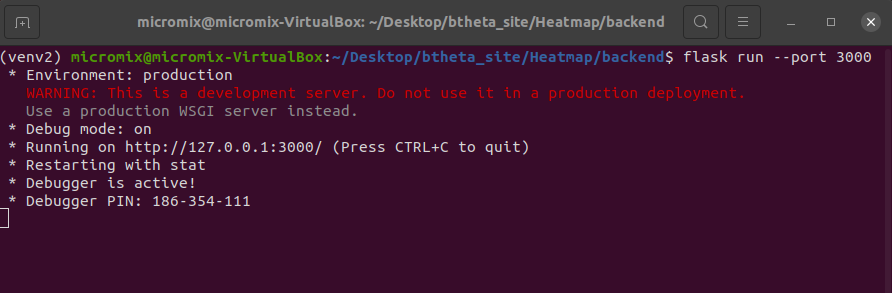
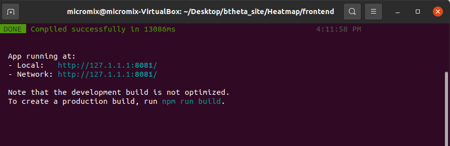

# Micromix user guide

## Contents
- [Micromix](README.md#micromix-user-guide)
- [Installing and running](installing_running.md#installing-and-running-micromix)
    - [Micromix](installing_running.md#installing-and-running-micromix)
    - [Plugins](installing_running.md#installing-and-running-micromix)
        - [1. Local installation](installing_running.md#installing-and-running-micromix)
            - [1.1 Virtual machine](installing_running.md#1-using-a-pre-built-virtual-machine)
            - [1.2 Containers](installing_running.md#2-using-docker-containers)
            - [1.3 Manual install](installing_running.md#3-manually-installing-micromix)
        - [2. Server deployment](installing_running.md#server-deployment)
            - [2.1 Containers](installing_running.md#2-using-docker-containers)
            - [2.2 Manual install](installing_running.md#3-manually-installing-micromix)
- [Using Micromix](using_micromix.md#micromix-user-guide)
    - [Selecting organism](using_micromix.md#selecting-organism)
    - [Selecting datasets](using_micromix.md#selecting-datasets)
    - [Combining datasets](using_micromix.md#combining-datasets)
    - [Filtering data](using_micromix.md#filtering-data)
    - [Visualising data](using_micromix.md#visualising-data)  
- [Modifying Micromix](modifying_micromix.md#micromix-user-guide)
    - [Preparing a new bacteria](modifying_micromix.md#preparing-a-new-bacteria)
    - [How to add a new organism](modifying_micromix.md#how-to-add-a-new-organism)
    - [How to add new expression data](modifying_micromix.md#how-to-add-new-expression-data)
    - [Modifying or adding gene or pathway annotations](modifying_micromix.md#modifying-or-adding-gene-or-pathway-annotations)
    - [Adding new visualisation plugins](modifying_micromix.md#adding-new-visualisation-plugins)
    - [Database maintenance](modifying_micromix.md#database-maintenance)


<br><br>


# 1. Installing and running plugins

Plugins allow the user to visualise the data stored within Micromix. As part of the standard installation, there are 2 plugins that are available. 

1) The Clustergrammer heatmap, which can be run without any configuration - and is an example of using an existing API
2) The HIRI heatmap, which we provide the installation instructions below.

Additional plugins can be developed and incorporated into Micromix, and will follow many of the following installation steps. A good example is a recently developed principal component analysis (PCA) plugin, that describes in detail many of the key steps required when building a plugin. The PCA plugin can be accessed here [xxxxxxxxxxxxx]. 

<br>

To install and run the HIRI heatmap, there are two options currently available, depending on user requirements:

1.1) Using Docker containers <br>
1.2) Manual installation

## 1.1. Using Docker containers

Docker is a platform that automates the deployment of applications inside lightweight, portable containers. These containers package up the application, along with its environment and dependencies, ensuring consistency across different environments. 

The following steps assume:
 - You have access to a debian-based Linux 64-bit machine
 - You have sudo (admin) access

We have created the HIRI heatmap so it can be installed and run with Docker. To prepare the machine, we will need to install various software.


1. Install Docker: The latest instructions can be found [here](https://docs.docker.com/engine/install/ubuntu/)

```bash
# Uninstall old versions or conflicting packages
for pkg in docker.io docker-doc docker-compose docker-compose-v2 podman-docker containerd runc; do sudo apt-get remove $pkg; done

# Add Docker's official GPG key:
sudo apt-get update
sudo apt-get install ca-certificates curl
sudo install -m 0755 -d /etc/apt/keyrings
sudo curl -fsSL https://download.docker.com/linux/ubuntu/gpg -o /etc/apt/keyrings/docker.asc
sudo chmod a+r /etc/apt/keyrings/docker.asc

# Add the repository to Apt sources:
echo \
  "deb [arch=$(dpkg --print-architecture) signed-by=/etc/apt/keyrings/docker.asc] https://download.docker.com/linux/ubuntu \
  $(. /etc/os-release && echo "$VERSION_CODENAME") stable" | \
  sudo tee /etc/apt/sources.list.d/docker.list > /dev/null

# Update
sudo apt-get update

# Install
sudo apt-get install docker-ce docker-ce-cli containerd.io docker-buildx-plugin docker-compose-plugin

# Test install (this will download a test container and display "Hello from Docker!")
sudo docker run hello-world

# Add current user to the docker user group, so you don't have to run docker with sudo each time
sudo usermod -aG docker $USER

```

2. Install MongoDB (we install this locally so user sessions are not lost if the containers need to be restarted or replaced etc). 

> *It is important to install MongoDB after Docker, otherwise you will get errors trying to add 172.17.0.1*

```bash
# Install MongoDB
sudo apt install -y mongodb #or from here if this fails or not using Ubuntu: https://www.mongodb.com/docs/manual/tutorial/install-mongodb-on-ubuntu/

# Confirm it is running
sudo systemctl status mongodb

# If not, then start with
sudo systemctl start mongodb

# We also need to add in an additional IP address that allows Docker to communicate with this local installation of MongoDB
sudo vim /etc/mongodb.conf

# You will need to add in 172.17.0.1 so the bind_ip address has two values
bind_ip = 127.0.0.1,172.17.0.1 

# Restart mongoDB
sudo systemctl restart mongodb
```

> *172.17.0.1 is typically used by Docker's bridge network to allow the containers to connect with the host version of MongoDB*

3. Download the Micromix repository from Github

```bash
git clone https://github.com/BarquistLab/Micromix.git
```


4. Run HIRI heatmap

```bash
# Browse to the correct directory
cd Micromix/Heatmap

# Run docker compose
# This is linked to two dockerfiles, one for the backend and one for the frontend
sudo docker compose build 
sudo docker compose up

# If you require that the containers run in the background, you can use
docker compose up --detach

# These two commands may take some time to complete
# Once the containers have completed running, you should see this line from the command line (or something similar)
* Running on http://127.0.0.1:8081 

# Browse to this address in your browser, and the HIRI heatmap loading screen will be visible. 

# You will not be able to interact with the heatmap at this point - you will have to link the heatmap up to a Micromix instance, that will pass data to this waiting server, which will then display the associated heatmap.

# To stop the containers - first press 'ctrl + C', then
docker compose down

# To also remove the associated volumes (-v) and images (-)
docker compose down --volumes --rmi

# To remove all containers, volumes (-v) and images (-) etc
docker system prune --all --volumes
```


> *Note: <br>
> Following these commands will allow you to run the HIRI heatmap on any compatible computer. If you would like to setup a plugin server that can be publically viewed through the internet, see [Server deployment](installing_running.md#server-deployment).*


## 1.2. Manual installation


There are a number of requirements if running locally or on a server for the first time. The heatmap follows the same infrastructure that the main site does: there is a frontend and backend, which then communicate through a specified port where the resulting heatmap can be displayed within the site when clicking on the heatmap plugin button.

**Step 1:** Prepare the heatmap backend: 

```bash 
# Browse to the backend
cd Micromix/Heatmap/backend

# Create an additional python virtual environment
python3 -m venv venv2
# Enter the environment
source venv2/bin/activate

# Install the required python libraries
pip3 install -r requirements.txt

# Enable debugging (optional)
export FLASK_DEBUG=1

# Launch Flask server
flask run

# You should see the following output
```




**Step 1:** Prepare the heatmap frontend: 

```bash
# Change to the frontend
cd Micromix/Heatmap/frontend

# Install node dependencies
npm install

# Launch frontend
npm run serve

# You should see the following output
```



> *Note: <br>
> When visiting the IP address of the heatmap, a loading screen will be visible. You will not be able to interact with the heatmap at this point - you will have to link the heatmap up to a Micromix instance, that will pass data to this waiting server, which will then display the associated heatmap.*


# Server deployment

This section allows you to run the HIRI heatmap on a server that is accessible to the public.

Similar to a local install, you have the option of installing the HIRI heatmap using Docker containers, or with a manual installation.

> *Note: <br>
> The code within the Github repository is adapted to run on a local machine for testing, making it easy for people to test the functionality of the heatmap. To create a dedicated server, some small changes are required that revolve around linking the server IP address to the heatmap.*

<br>

To make the heatmap accessible through the internet, you will need to have access to a running online server that is capable of publically displaying websites with an IP address.

If you don't have any institute or department hosting services available, you can create and run a virtual machine from different web services, such as Amazon Web Services (AWS) or using Google Cloud. An AWS tutorial can be viewed [here](https://aws.amazon.com/getting-started/launch-a-virtual-machine-B-0/), and with Google Cloud [here](https://cloud.google.com/compute/docs/create-linux-vm-instance). 

If choosing one of these online services, here is a checklist of requirements:

 - You will need to use a Debian-based Linux distribution (64-bit) - we recommend Ubuntu. 
 - Depending on the expected traffic, 2 cores, 8-16GB of ram and between 10-20GB of hard drive space should initially be sufficient
 - When configuring the VM, ensure that it is assigned a public IP address - this is important for the site to be hosted (you will need to remember the IP address for later steps).
 - Port 5000 will need to be opened, allowing the frontend and backend to communicate. Under a Google Cloud VM, this firewall rule can be added by going to the **Navigation menu** >>  **VPC network** >> **Firewall**. From here, select **Create firewall rule**, using default options, but changing the protocol to **TCP**, the port to **5000**, Type to **Ingress** and **Apply to all targets**. 


Download Micromix repository from Github

```bash
git clone https://github.com/BarquistLab/Micromix.git
```

**You now have two options.**

1) Use Docker containers to run the site, or <br>
2) Manually install Micromix.

> *Note: <br> 
> Here are some suggestions if you are unsure about which option to select. If using the Docker containers, this is intended to streamline the installation process, but will take up more hard drive space as the containers require between 2-3GB and requires slightly more network configuration changes. The manual install option takes more time to install, but takes up less space and has more straight forward network requirements.* 

## 2.1. Using Docker containers

Install Docker

The following steps 1-3 are identical to [Containers](installing_running.md#2-using-docker-containers) - and can be skipped if already completed.

The latest Docker instructions can be found [here](https://docs.docker.com/engine/install/ubuntu/) if any errors occur.

```bash
# Uninstall old versions or conflicting packages
for pkg in docker.io docker-doc docker-compose docker-compose-v2 podman-docker containerd runc; do sudo apt-get remove $pkg; done

# Add Docker's official GPG key:
sudo apt-get update
sudo apt-get install ca-certificates curl
sudo install -m 0755 -d /etc/apt/keyrings
sudo curl -fsSL https://download.docker.com/linux/ubuntu/gpg -o /etc/apt/keyrings/docker.asc
sudo chmod a+r /etc/apt/keyrings/docker.asc

# Add the repository to Apt sources:
echo \
  "deb [arch=$(dpkg --print-architecture) signed-by=/etc/apt/keyrings/docker.asc] https://download.docker.com/linux/ubuntu \
  $(. /etc/os-release && echo "$VERSION_CODENAME") stable" | \
  sudo tee /etc/apt/sources.list.d/docker.list > /dev/null
# update
sudo apt-get update
```


**Backend changes:**

TBD - change network config XXXXXXXXXXXXXXXXXXXXXXXXXXXXXXX

**Frontend changes:**

TBD - change network config XXXXXXXXXXXXXXXXXXXXXXXXXXXXXXX


### 2) Micromix - Manual install
 
To prepare the server with the required software, you will need to follow the instructions from [Manually installing Micromix](installing_running.md#3-manually-installing-micromix). You can skip the last steps of ```npm run serve``` for the frontend and ```flask run --port 3000``` for the backend.

> *Note: <br>
> The code within the Github repository was adapted to run on a local machine for testing, making it easy for people to test Micromix. To run Micromix on a server, some small changes are required that revolve around linking the server IP address or domain name.*


**Frontend changes:**

Change the IP address to your servers IP address

```bash
# Open App.vue
vim Website/frontend/src/App.vue

# Change the line that points to the backend
# backend_url: 'http://127.0.0.1:5000', //This should be changed for production
# Change this to your server IP address or domain name
backend_url: 'http://192.100.12.87:5000', 
``` 

You can now build the frontend

```bash
# Change to frontend
cd Website/frontend

# Building the site will create files under the /dir directory 
npm run build
```

**Backend changes:**

Change the address of MongoDB
```bash
# Change to backend
cd ../backend

# Open up app.py
vim app.py

# Change this line: client = MongoClient('172.17.0.1', 27017) - pointing directly to the local machine
client = MongoClient()

```

**Install deployment software:**

Finally, we need to install and run a HTTP server (Nginx) and a web server gateway interface (WSGI) (Gunicorn), allowing the site to hosted and displayed to users on the IP address or domain name, such as *Micromix.com*. 

```bash
# Install Gunicorn
pip3 install gunicorn 

# Install Nginx
sudo apt install nginx
```

Run Gunicorn

```bash
# Make sure you are in the backend folder where app.py is located
gunicorn --bind 0.0.0.0:5000 app:app --access-logfile /home/$USER/Micromix/Website/backend/gunicorn_logs.log --workers=2

# Here's a brief explanation of what the command contains
# --bind 0.0.0.0:5000   binds the backend to port 5000, which will be used by the frontend to connect
# app:app               Runs app within app.py
# --access-logfile      Saves the log files to the current user location
# --workers=2           Uses 2 cores

# Note: running the above command is designed to check for any errors. If successful, press CTRL+C to stop running. 
# To run in the background, use:
gunicorn --bind 0.0.0.0:5000 app:app --access-logfile /home/$USER/Micromix/Website/backend/gunicorn_logs.log --workers=2 --daemon
```

Install, configure and run Nginx

```bash
# Make a copy of the current Nginx configuration file
mv /etc/nginx/sites-available/default /etc/nginx/sites-available/default_old

# You will need to copy an updated configuration file that has been adapted for Micromix
cp Website/frontend/Nginx/nginx_manual_install.config /etc/nginx/sites-available/default

# Edit the IP address/domain names and location of the /dist folder
vim /etc/nginx/sites-available/default

# Copy to sites-enabled location
ls -s /etc/nginx/sites-available/default /etc/nginx/sites-enabled/

# Check if config file is valid
sudo nginx -t  

# Restart service to apply changes
sudo systemctl restart nginx
```

You will be able to visit your IP address or domain name in a browser and Micromix will be running


> *Note: <br>
> If you would like to integrate the HIRI heatmap on to your site, we recommend using our dedicated server that is already setup and running, you will simply have to update the heatmap plugin IP address. Please reach out to the Manuscript authors for the heatmap server IP address and details.*  


## HIRI heatmap deployment

The heatmap server can also be installed manually or with Docker containers, similar to the main Micromix Website.

Both options require that the Github repository has already been downloaded and MongoDB has been installed

Download repository

```bash
# Install Git
sudo apt-get install git

# Download repository
git clone https://github.com/BarquistLab/Micromix.git

# Change to Heatmap directory
cd Micromix/Heatmap
```

Install MongoDB

```bash
# Install MongoDB
sudo apt install -y mongodb

# Confirm it is running
sudo systemctl status mongodb

# If not, then start with
sudo systemctl start mongodb
```


### 1) HIRI heatmap - Using Docker containers

to be completed

### 2) HIRI heatmap - Manual install


something about adding HM ip address to MongoDB?????????

**The Heatmap backend:**


```bash
sudo apt update
sudo apt install python3-pip
pip3 install wheel
pip3 install biopython

# To allow virtual env (check python version first)
sudo apt-get install python3.8-venv 

# Change to backend
cd Micromix/Heatmap/backend

# Create python virtual environment
python3 -m venv venv

# Enter the environment
source venv/bin/activate

# Install the required python libraries
pip3 install -r requirements.txt
```

Next, we need to configure the networking between the Micromix server the heatmap will be the plugin, and the heatmap server

```bash
# Change the link in app.py to use local MongoDB (heatmap)
vim Micromix/Heatmap/backend/app.py

# Change client = MongoClient('172.17.0.1', 27017), to the Micromix instance you would like the heatmap to connect to. Depending on your server configuration, you may need to create a firewall rule for port 27017 if using a commercial service such as AWS or GCP (heatmap)
client = MongoClient("mongodb://192.100.12.87:27017")

# At this point, you will also need to open port 27017 on your Micromix server, providing access for the heatmap. Again, if using a commercial service, you will need to create a firewall rule. 

# Next, you will need to add the heatmap IP address to MongoDB on the Micromix server, providing access. On the Micromix server, this can be added (Micromix)
sudo vim /etc/mongodb.conf

# Change bind_ip = 127.0.0.1 - adding in the heatmap IP address (Micromix)
bind_ip = 127.0.0.1, 192.200.12.87

# Add firewall rule (Micromix)
sudo ufw allow from 192.200.12.87 to any port 27017

# Restart MongoDB (Micromix)
sudo systemctl restart mongodb
```

Back on the heatmap server, we will install configure and run Gunicorn

```bash
# Install gunicorn
pip3 install gunicorn

# Create wsgy.py
vim wsgy.py

# Add this information to wsgy.py
from app import app

if __name__ == '__main__':
   app.run()

# Make sure you are in the backend folder where app.py is located
gunicorn --bind 0.0.0.0:5000 wsgy:app --access-logfile /home/$USER/Micromix/Heatmap/backend/gunicorn_logs.log --workers=2

# Note: running the above command is designed to check for any errors. If successful, press CTRL+C to stop running. 

# To run in the background, use:
gunicorn --bind 0.0.0.0:5000 wsgy:app --access-logfile /home/$USER/Micromix/Heatmap/backend/gunicorn_logs.log --workers=2 --daemon

```


**The Heatmap frontend:**

```bash
# Change to the frontend
cd Micromix/Heatmap/frontend

# Make sure dependencies are already installed
sudo apt-get install gcc g++ make
sudo apt-get install libssl-dev libcurl4-openssl-dev

# Download and install Node.js
sudo apt install curl
curl -sL https://deb.nodesource.com/setup_18.x -o nodejs_setup.sh
# Change permissions
sudo chmod 777 nodejs_setup.sh
# Run
sudo ./nodejs_setup.sh
# Install
sudo apt-get install -y nodejs

# Install vue-cli with Node Package Manager (npm)
sudo npm install -g @vue/cli

# Install Eslint and axios
npm install --save-dev eslint eslint-plugin-vue
npm i axios

# Initialise ESLint
./node_modules/.bin/eslint --init

# Use these responses
✔ How would you like to use ESLint? · "To check syntax and find problems"
✔ What type of modules does your project use? · "syntax and markup" # Default option
✔ Which framework does your project use? · "vue"
✔ Does your project use TypeScript? · "No"
✔ Where does your code run? · "browser"
✔ What format do you want your config file to be in? · "JavaScript"
The config that youve selected requires the following dependencies:

eslint-plugin-vue@latest
✔ Would you like to install them now with npm? · "Yes"
Installing eslint-plugin-vue@latest

# This creates a file called .eslintrc.js

# You will need to modify this file in 2 places
# 1) Comment out the line below to avoid an error about process not being defined (or similar)

vim .eslintrc.js

    "extends": [
        //"eslint:recommended",  //comment this line
        "plugin:vue/essential"

# 2) Add a rule to allow multi-word component names
"rules": {
        'vue/multi-word-component-names': 'off',
    }

# Finally, we can install node dependencies
npm install
```

Link the IP address and port of the backend to the frontend

```bash
# Edit deckglCanvas.vue
vim Micromix/Heatmap/frontend/src/components/deckglCanvas.vue

# Change backendUrl: 'http://127.0.0.1:3000', to the ip address/domain name of the heatmap and the backend port
backendUrl: '192.200.12.87:5000',
```

Build the heatmap static files

```bash

# Change to frontend directory
cd Micromic/Heatmap/frontend

# Build - creating the dist/ folder
npm run build
```

Install configure and run Nginx

```bash
# Install Nginx
sudo apt install nginx

# Make a copy of the current Nginx configuration file
mv /etc/nginx/sites-available/default /etc/nginx/sites-available/default_old

# You will need to copy an updated configuration file that has been adapted for Micromix
cp Heatmap/frontend/Nginx/nginx_manual_install.config /etc/nginx/sites-available/default

# Edit the IP address/domain names and location of the /dist folder
vim /etc/nginx/sites-available/default

# Copy to sites-enabled location
ls -s /etc/nginx/sites-available/default /etc/nginx/sites-enabled/

# Check if config file is valid
sudo nginx -t  

# Restart service to apply changes
sudo systemctl restart nginx
```

You will be able to visit your IP address or domain name in a browser and you will be able to see the loading animation for the heatmap.