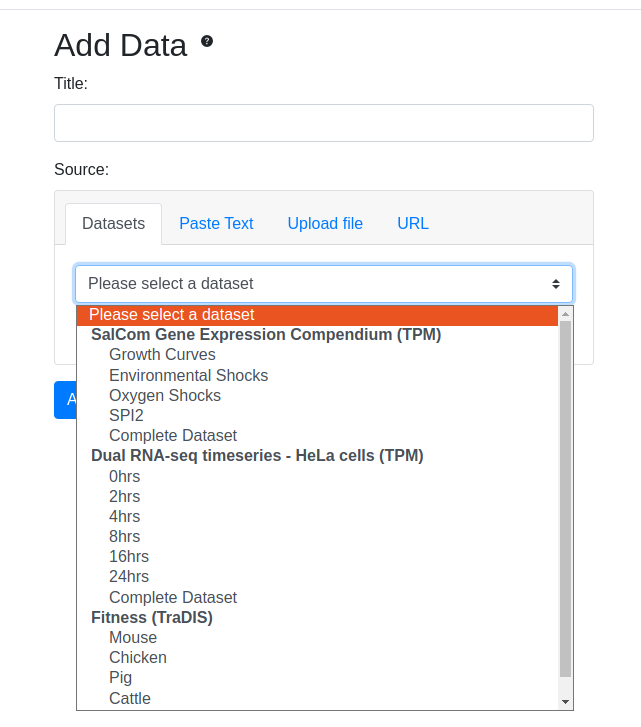

# Micromix user guide

## Contents
- [Micromix](README.md#micromix-user-guide)
- [Installing and running](installing_running_micromix.md#installing-and-running-micromix)
    - [Micromix](installing_running_micromix.md#installing-and-running-micromix)
    - [Plugins](installing_running_plugins.md#1-installing-and-running-plugins)
- [Using Micromix](using_micromix.md#micromix-user-guide)
    - [Selecting organism](using_micromix.md#selecting-organism)
    - [Selecting datasets](using_micromix.md#selecting-datasets)
    - [Combining datasets](using_micromix.md#combining-datasets)
    - [Filtering data](using_micromix.md#filtering-data)
    - [Visualising data](using_micromix.md#visualising-data)  
- [Modifying Micromix](modifying_micromix.md#micromix-user-guide)
    - [Preparing a new bacteria](modifying_micromix.md#preparing-a-new-bacteria)
    - [How to add a new organism](modifying_micromix.md#how-to-add-a-new-organism)
    - [How to add new expression data](modifying_micromix.md#how-to-add-new-expression-data)
    - [Modifying or adding gene or pathway annotations](modifying_micromix.md#modifying-or-adding-gene-or-pathway-annotations)
    - [Adding new visualisation plugins](modifying_micromix.md#adding-new-visualisation-plugins)
    - [Database maintenance](modifying_micromix.md#database-maintenance)

  

# Using Micromix

This guide highlights the functionality of the Micromix website, designed to be adaptable for use with multiple organisms and datasets. New organisms and datasets can be added or removed as required, and plugins can be developed and integrated for additional visualisation options.

## Selecting organism

The first page allows you to select from the available organisms or bacteria.

## Selecting datasets

Once an organism is chosen, you have options to select desired datasets or load custom data from sources such as a delimited file or URL.

You also have the choice of adding or removing specific columns.

Clicking **Add** will load the data.

The above image shows main elements of the site once data has been added. 

### Address bar:

Each time new data is selected, a new database entry is added and assigned a unique ID. This configuration ID is added to the address bar, linking the current session and storing any data transformations, filtering, and visualisations. This becomes useful when revisiting the site and instead of re-loading data and applying filters, the config ID can be pasted into the address bar and the existing session will be restored. This link can also be shared with collaborators, providing an easy way to share interesting results or observations.

### Toolbar:

The toolbar on the top right of the website includes four buttons:

- **Padlock button**: Locks the current state of the site to prevent further edits. This would be useful when sending to a collaborator or if wanting to include a URL within a manuscript or similar document.
- **Download button**: Allows users to download the currently selected dataset in Excel or a delimited file format (such as .csv).
- **New document button**: Reloads the website for new dataset selection.
- **Help button**: Provides explanations for various features of the site when clicked.

### Plugins / visualisations:

This is where the data visualisation plugins are loaded as separate buttons. Each plugin when clicked will allow the user to visualise their data in a specific way. Additional plugins can be created and added. For details on how to add new plugins, see [Adding new visualisation plugins](modifying_micromix.md#adding-new-visualisation-plugins) 

### Filters:

Standard filters allow functional annotations to be searched, such as Gene Ontology (GO) and KEGG IDs - these are available under **Add Filter**. Custom gene lists such as virulence factors/ncRNA etc can also be added to allow users to select pre-defined genesets of interest - these are available under **Preset Filters**. Values within the table can also be transformed, such as converting to Log, or displaying a certain number of decimal places - these are available under **Transform Data**. 

## Combining datasets

If you choose to examine more than one dataset, you can merge the underlying data into a single matrix that is displayed and explorable within the site. Each dataset will contain the specified name above the condition (column). To use this feature, you need to already have a dataset chosen (by following the previous step). Then  click on **Upload data**, allowing you to select the additional dataset you wish to combine with your existing selection. 

After selecting an additional dataset, you can choose if this additional data should be added to the right or left. This is shown in the figure below with the black squared matrix (**Matrix Preview**). By clicking on the light grey squares (on either side), this decides where the new data will be added.

> Note: When merging datasets, there needs to be an overlap of a common gene identifier, such as **locus tags**. If both datasets use different naming conventions, then the merge will fail. Other common pitfalls are not having the locus tag identifier in exactly the same format. For example, `locus tag` and `locus_tag` will cause an error. If this occurs, you will need to change the columns in the originating data to be identical, which is described here: [How to add new expression data](modifying_micromix.md#how-to-add-new-expression-data)

 

## Filtering data

As discussed above, there are different options of filtering and transforming the user specified dataframe.

**Row filters:**
 - Allows row-based filters, such as specific locus tags, or filtering numerical values based upon logic criteria (greater-than, less-than etc).

**Functional annotations:**
 - Allow you to type the beginning of a category/pathway and the closest matches appear in the dropdown menu (although only 10 are initially visible, additional categories/pathways can be viewed by scrolling). Functional annotations and filters can be modified as described here: [Modifying or adding gene or pathway annotations](modifying_micromix.md#modifying-or-adding-gene-or-pathway-annotations)

**Pre-defined genesets:**
 - You can load in genesets of interest that can be filtered for and can change depending on the selected organism. When the Salmonella data is selected, *Pathogenicity Islands* are loaded. When Bacteroides is selected, this changes to *ncRNAs*.

**Transform Data:**
 - Here you have the option of data transformations, such as *Rounding Values*, *Hiding Columns*, *Calculating fold-changes* etc.

### Examples of filtering
 - Filters can either be a singular (as shown above), or chained together.

 

## Visualising data

There are currently 2 visualisation plugins available, the HIRI Heatmap and Clustergrammer.

### Heatmap

The HIRI heatmap comes pre-bundled with Micromix. It was designed with WebGL, providing 3D and 2D views of the selected data. 
 - The visualisation options are highly customisable, including colour gradients, lighting etc.
 - Heatmap images can be exported as images.
 - The 'save' button allows users to preserve their current visualisation settings such as orientation, zoom, and colour gradients. When the URL is shared or the same dataset is reselected for visualisation with the HIRI heatmap, these saved settings will be applied. 
 - A major advantage of the HIRI heatmap is its speed, enabling large datasets to be quickly displayed.

> Note: If the heatmap is not working, you may need to make sure it has been deployed correctly - see [Plugins](installing_running_plugins.md#1-installing-and-running-micromix)

### Clustergrammer

The Clustergrammer plugin uses an API from the Ma'ayan lab. Data from Micromix is sent to their API, which returns an interactive heatmap. Features include row and column clustering and the ability to export the heatmap as an image.

> It should be noted that < 200 genes should be used for visualisations (an in-built restriction built into the API), otherwise an error may occur. If you require larger datasets, there is an option of deploying your own [Clustergrammer server](https://maayanlab.cloud/clustergrammer/) 

